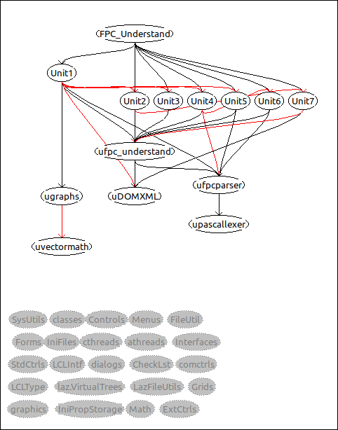

# FPC Understand

FPC-Understand is a freepascal code analysing tool written in FreePascal.
It's main purpose is to statically analyse FreePascal code and give easy access to it's architecture informations.

These informations are:
- Unit dependencies
- Class hierarchy
- Statisics like: lines of code, cyclomatic complexity ...

The program is mainly designed to work with Lazarus .lpi files, but it is not forced to use .lpi files.

All statistics and analyses are exportable in .csv file format (except the unit dependency graph this is exported as .png)

## How to compile ?

Compile the code using Lazarus 2.2.0 or higher, all plattforms where you can run Lazarus on should be able to compile and run FPC Understand as it is not dependand to any higher level library.

## How to use ?

1. Start the program clicl "Edit" -> "Project settings"
2. Fill in the Name in page "General"
3. Select a .lpi file (second "select" button from top)
4. click ok

## Editing the dependency graph

Simple click and drag nodes, use left mouse to create a rectangle for selecting multiple nodes. Holding "shift" while clicking on nodes will add them to a selected colection.

## How do i get to the calculated values

1. Select none (= all) or as much nodes you want to get the calculations of
2. Open the wanted calculation via "Edit" -> "Show *" or by double clicking on one of the selected nodes