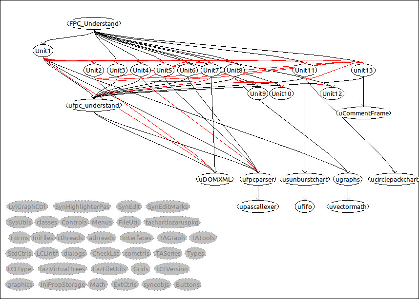
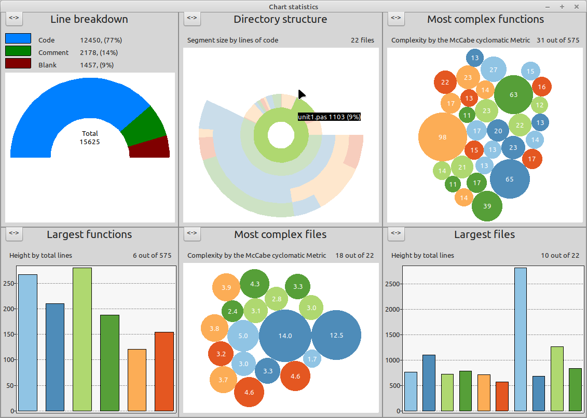

# FPC Understand

FPC-Understand is a Free Pascal code analysing tool written in Free Pascal.
It's main purpose is to statically analyse Free Pascal code and give easy access to it's architecture informations.

These informations are:
- Unit dependencies
- Class hierarchy
- Statisics like: lines of code, cyclomatic complexity ...

The program is mainly designed to work with Lazarus .lpi files, but it is not forced to use .lpi files.

All statistics and analyses are exportable in .csv file format (except the unit dependency graph this is exported as .png)

## How to compile ?

Compile the code using Lazarus 2.2.0 or higher, all plattforms where you can run Lazarus on should be able to compile and run FPC Understand as it is not dependand to any higher level library.

## How to use ?

1. Start the program click "Edit" -> "Project settings"
2. Fill in the Name in page "General"
3. Select a .lpi file (second "select" button from top) in Page "Files"
4. [Optional] Add further files that are not included in the selected .lpi file (or edit the .lpi file to correct includings)
5. click ok

## Editing the dependency graph

Use right mouse context menu to center nodes that are created outside the visible screen. 
Click and drag nodes. 
Use left mouse button to create a rectangle for selecting multiple nodes. Holding "shift" while clicking on nodes will add them to a selected collection.

## How do i get to the calculated values ?

1. Select none (= all) or as much nodes you want to get the calculations of
2. Open the wanted calculation via "Edit" -> "Show *" or by double clicking on one of the selected nodes

## Known issues:
- The graph component does not support "same" filenames in the project. 
  
  -> If your project contains 2 .pas files with same name but in different locations the graph will merge them into one single node, this will produce invalid dependencies

- The callgraph analysis is more a heuristic than a real code "understanding" 

  -> function pointers are not evaluated, function calls that have the same name are merged into the same node (see "same" filename issue)